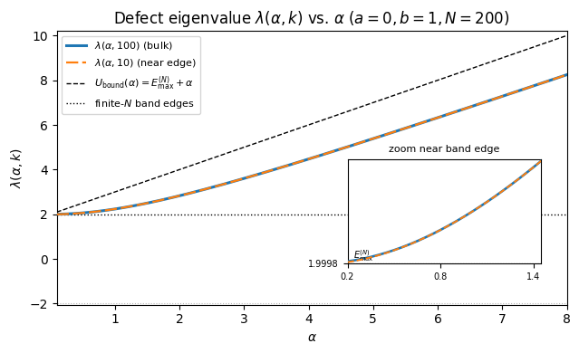
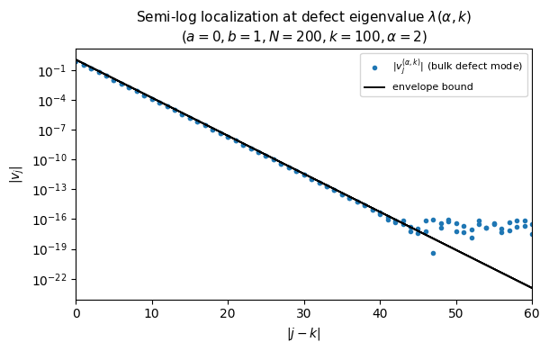

# Defect States in Discrete Schrodinger Chains

Python numerical experiments for defect eigenvalues and localized eigenvectors in finite one-dimensional discrete Schrodinger / tight-binding chains.

This repository contains the code for a Math 420 final project studying how a single on-site defect acts as a rank-one diagonal perturbation, producing an out-of-band eigenvalue and a geometrically localized eigenvector.

## Key idea

A finite one-dimensional discrete Schrodinger / tight-binding chain has modes spread across the lattice. Adding a single on-site defect can create an eigenvalue outside the usual band, with an eigenvector whose amplitude is concentrated near the defect site and decays away from it.

## Figures

The first figure tracks the out-of-band defect eigenvalue as the defect strength changes for both bulk and near-edge defect locations.



The second figure shows the semi-log localization profile of a representative defect eigenvector compared with a geometric envelope bound.



## What the script does

- Builds a finite tridiagonal Toeplitz chain with a single rank-one diagonal defect.
- Computes the defect eigenvalue for bulk and near-edge defect locations.
- Plots the defect eigenvalue as a function of defect strength alpha.
- Computes the localized defect eigenvector for a representative bulk defect.
- Plots the semi-log localization profile with the geometric envelope bound.
- Saves all generated figures to the `figures/` directory.

## Methods demonstrated

- Tridiagonal Toeplitz matrix construction
- Rank-one diagonal perturbation
- Symmetric eigenvalue computation
- Defect eigenvalue tracking
- Semi-log localization visualization
- Numerical comparison with localization envelope behavior
- Technical reporting and reproducible figure generation

## Repository structure

```text
discrete-schrodinger-defect-states/
├── README.md
├── LICENSE
├── defect_states_schrodinger_chains.py
├── requirements.txt
├── figures/
│   ├── fig1_defect_vs_alpha.pdf
│   ├── fig1_defect_vs_alpha.png
│   ├── fig2_semilog_env.pdf
│   └── fig2_semilog_env.png
└── report/
    └── final_project_report.pdf
```

## Setup

Create a virtual environment, then install the dependencies:

```bash
python -m venv .venv
source .venv/bin/activate
pip install -r requirements.txt
```

On Windows PowerShell, activate the environment with:

```powershell
.venv\Scripts\Activate.ps1
```

## Run

```bash
python defect_states_schrodinger_chains.py
```

The script writes these files to `figures/`:

```text
figures/fig1_defect_vs_alpha.pdf
figures/fig1_defect_vs_alpha.png
figures/fig2_semilog_env.pdf
figures/fig2_semilog_env.png
```

## Limitations

This is a finite-dimensional numerical experiment, not a full spectral-theory package. The script studies selected defect strengths and site locations, uses finite matrix approximations, and focuses on visualization and validation rather than exhaustive parameter analysis.

## Dependencies

The project uses:

- NumPy for matrix construction and symmetric eigensolvers
- Matplotlib for plotting
